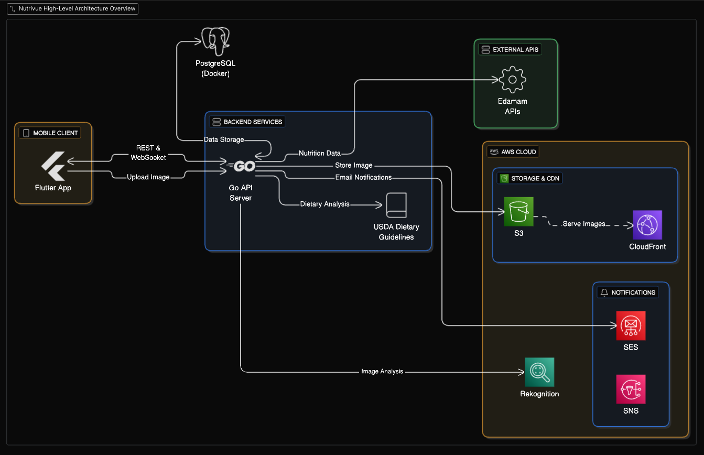

---

```markdown
# 🍽️ NutriSafe Backend (Golang)

This is the backend for the Nutrivue application. It provides APIs for user authentication, meal and food management, user fitness goals tracking, activity logging, notifications, real-time updates, AI-powered food recognition,According to  Dietary Guidelines for American - DGA, rule based food safety assesments.  

The project is written in **Go** using a layered architecture (controllers → services → models), with support for PostgreSQL, AWS S3, AWS Rekognition, and Edamam APIs.

---

## 📌 Features
- **Authentication**: JWT-based login/signup, secure password hashing.
- **Users & Devices**: Manage users and linked devices.
- **Meals & Food**: CRUD APIs for meals, food recognition (AWS Rekognition + Edamam).
- **Daily Goals & Progress**: Track calories, macros, and other goals.
- **Activity Logs**: Record user interactions and health activities.
- **Notifications**: Push notifications to connected devices.
- **Analytics**: Generate insights from meal and activity data.
- **Realtime**: WebSocket hub for live updates of push notifications.

---

## 🏗️ Project Structure
```

.
├── cmd/                # Main entrypoint
├── config/             # App configuration (env, database, etc.)
├── controllers/        # HTTP route handlers
├── db/                 # Database docker-compose setup
├── middlewares/        # Auth and other middleware
├── models/             # Database models
├── routes/             # Route registration
├── services/           # Business logic, integrations
└── utils/              # Helper utilities (JWT, S3, mailer, etc.)

````

---

## 🖼️ Architecture Overview

```markdown

````

---

## 🚀 Getting Started

### 1. Clone the repo

```bash
git clone https://github.com/your-username/nutrisafe-backend.git
cd nutrisafe-backend
```

### 2. Run PostgreSQL with Docker

```bash
cd db
docker-compose up -d
```

### 3. Configure Environment

Create a `.env` file at the project root:

```env
DB_HOST=localhost
DB_PORT=5432
DB_USER=postgres
DB_PASSWORD=postgres
DB_NAME=nutrisafe

JWT_SECRET=your_jwt_secret
AWS_REGION=your_region
AWS_ACCESS_KEY_ID=your_key
AWS_SECRET_ACCESS_KEY=your_secret
S3_BUCKET=your_bucket
EDAMAM_APP_ID=your_id
EDAMAM_APP_KEY=your_key
```

### 4. Run the server

```bash
go run cmd/main.go
```

---

## 📡 API Endpoints (Examples)

| Method | Endpoint                | Description                 |
| ------ | ----------------------- | --------------------------- |
| POST   | `/api/auth/signup`      | Register new user           |
| POST   | `/api/auth/login`       | Login & get JWT             |
| GET    | `/api/meals`            | Get user meals              |
| POST   | `/api/meals`            | Add new meal                |
| GET    | `/api/food/:id`         | Get food details            |
| POST   | `/api/goals/daily`      | Set daily goals             |
| GET    | `/api/analytics`        | Fetch analytics             |
| WS     | `/api/realtime/connect` | Connect to realtime updates |

---

## 🛠️ Tech Stack

* **Language**: Go (Golang)
* **Database**: PostgreSQL
* **ORM**: GORM
* **Auth**: JWT
* **Cloud Services**: AWS S3, AWS Rekognition
* **APIs**: Edamam
* **Containerization**: Docker

---

## 📌 Contributing

1. Fork the repo
2. Create a feature branch (`git checkout -b feat/your-feature`)
3. Commit changes (`git commit -m "feat: add new feature"`)
4. Push branch (`git push origin feat/your-feature`)
5. Open a Pull Request 🚀


```
---

